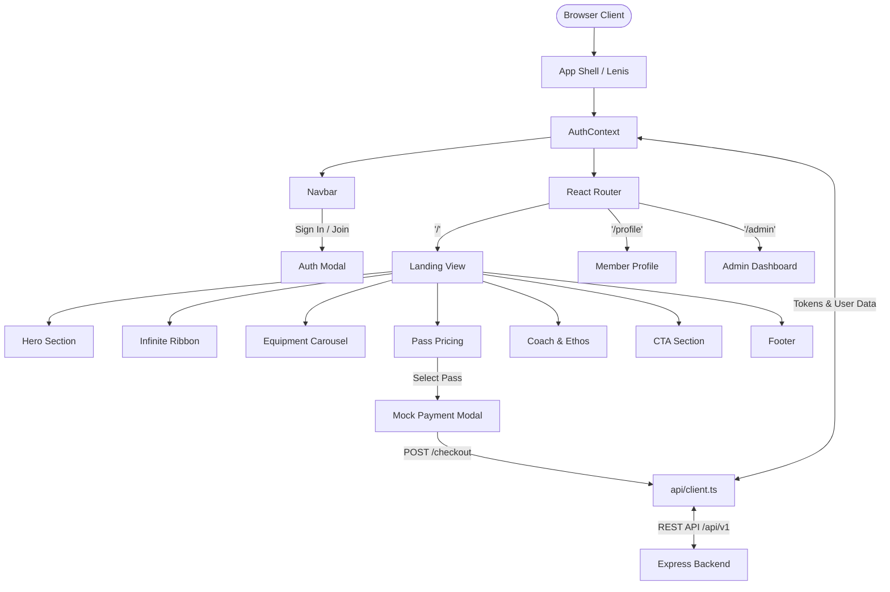

# 18 Hours Fitness Frontend

Client web application for 18 Hours Fitness (Mumbra, Maharashtra). Built with React 19, TypeScript, Tailwind CSS v4, and Motion. Connects to the Express backend for member authentication, pass purchases, member portals, and gym administration.

---

## Tech Stack

* **Framework**: React 19, TypeScript
* **Build Tool**: Vite 8 with `@vitejs/plugin-react`
* **Styling**: Tailwind CSS v4
* **Motion & Scrolling**: Motion (`motion/react`), GSAP, Lenis
* **Routing**: React Router DOM v7
* **Icons**: Lucide React
* **Linting**: Oxlint

---

## Directory Structure

```
frontend/
├── public/
│   ├── images/               # Facility and equipment photos
│   │   ├── hero-athlete.jpg  # Cable crossover athlete photo
│   │   ├── gym-legpress.jpg  # Plate-loaded leg press
│   │   ├── gym-crossover.jpg # Cable crossover rig
│   │   ├── gym-cardio.jpg    # Treadmills and cardio area
│   │   └── gym-storefront.jpg# Front entrance
│   ├── favicon.svg           # Brand favicon
│   └── logo.png              # 18 Hours logo
├── src/
│   ├── api/
│   │   └── client.ts         # Fetch wrapper with JWT injection and 401 refresh
│   ├── components/
│   │   ├── ui/
│   │   │   ├── infinite-ribbon.tsx # Angled athletic marquees (-3.5 deg / +3.5 deg)
│   │   │   ├── gym-carousel.tsx    # Drag-enabled equipment carousel
│   │   │   └── monet-pricing.tsx   # Pass pricing table with cardio toggle
│   │   ├── AuthModal.tsx     # Login and registration dialog
│   │   ├── Footer.tsx        # 4-column footer with contact details and hours
│   │   ├── MockPaymentModal.tsx # Checkout simulation dialog
│   │   ├── Navbar.tsx        # Floating navbar with active section highlight
│   │   ├── ScrollProgress.tsx# Scroll progress bar
│   │   ├── ScrollReveal.tsx  # Scroll animation trigger
│   │   └── ScrollToTopButton.tsx # Back-to-top button
│   ├── context/
│   │   └── AuthContext.tsx   # Auth state and token management
│   ├── views/
│   │   ├── LandingView.tsx   # Main landing page
│   │   ├── ProfileView.tsx   # Member portal: pass status, QR pass, receipts
│   │   └── AdminDashboardView.tsx # Admin dashboard: revenue, member list, plans
│   ├── types/
│   │   └── index.ts          # TypeScript type definitions
│   ├── lib/
│   │   └── utils.ts          # Class helper (clsx + tailwind-merge)
│   ├── App.tsx               # Root component and routes
│   ├── main.tsx              # Application entry point
│   └── index.css             # Tailwind imports and font definitions
├── index.html
├── package.json
├── tsconfig.json
└── vite.config.ts
```

---

## Application Flow



---

## Sections and Features

### 1. Hero
Displays the main headline with Graduate typography, background athlete photo, and links to pass selection and signup.

### 2. Athletic Ribbon
Two counter-rotating marquees angled at -3.5 degrees and +3.5 degrees. Uses vertical mask gradients to blend into the dark background.

### 3. Equipment Carousel
Touch and mouse drag slider with auto-advance every 3.8 seconds. Adjusts card width based on screen width (mobile: screen minus padding; tablet: 300px; desktop: 320px).

### 4. Pass Pricing
Four pass durations:
* **1 Month** (30 Days)
* **3 Months** (90 Days, Most Popular)
* **6 Months** (180 Days)
* **1 Year** (365 Days)

Includes a "With Cardio" toggle that recalculates the total price and daily rate.

### 5. Coach Profile & Standard
Details founder Imran Shaikh, facility operating hours (5:00 AM to 11:00 PM), and gym rules.

### 6. Member Portal (`/profile`)
Shows days remaining on active passes, digital barcode pass for entrance check-in, and transaction history.

### 7. Admin Dashboard (`/admin`)
Shows gross revenue, active member count, roster search, and pass management.

---

## Responsive Breakpoints

| Breakpoint | Target | Layout |
| :--- | :--- | :--- |
| **`< 480px`** | Mobile | Stacked CTA buttons, single-column footer lists, 3-column nav drawer. |
| **`480px - 640px`** | Large Phones | 2-column footer grid, 1.2 visible carousel cards. |
| **`640px - 1024px`** | Tablets | 2-column pass grid, 2.2 carousel cards. |
| **`>= 1024px`** | Desktop | 4-column pass pricing, 3.5 carousel cards, horizontal floating navbar. |

---

## Configuration

Set the backend API URL in `frontend/.env`:

```ini
VITE_API_URL="http://localhost:5000/api/v1"
```

Defaults to `http://localhost:5000/api/v1` if unset.

---

## Development Commands

```bash
# Install dependencies
npm install

# Start development server at http://localhost:3000
npm run dev

# Check types and build for production
npm run build

# Run linter
npm run lint

# Preview production build
npm run preview
```

---

## Default Test Accounts

| Role | Email | Password | Access |
| :--- | :--- | :--- | :--- |
| **Administrator** | `admin@gym.com` | `AdminPassword123!` | Access `/admin`, manage passes, view revenue |
| **Member** | Register via modal | 8+ characters | Checkout, view `/profile`, test pass activation |
